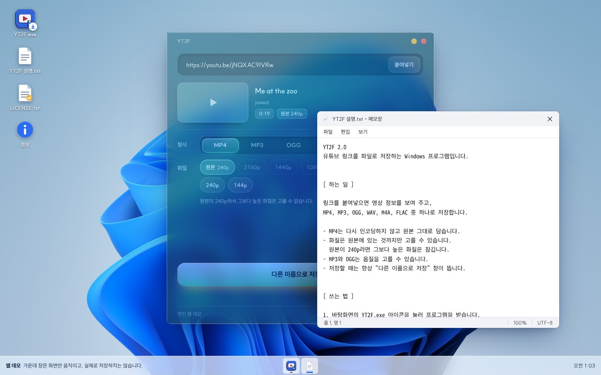

# YT2F

유튜브 링크를 넣으면 파일로 저장해 주는 Windows 프로그램입니다.
MP4, MP3, OGG, WAV, M4A, FLAC으로 저장할 수 있습니다.



- 웹 데모: https://jobless-fish.github.io/YT2F/
- 프로그램 받기: [download/YT2F.exe](download/YT2F.exe) (데모 화면의 `YT2F.exe` 아이콘을 눌러도 받아집니다)

> **개인적인 용도로만 사용하세요.**
> 받은 영상과 소리를 다시 올리거나, 나눠 주거나, 돈을 버는 데 쓰면 안 됩니다.
> 저작권과 유튜브 약관을 지키는 것은 쓰는 사람의 책임입니다. 자세한 조건은 [LICENSE](LICENSE)에 있습니다.

## 받기 전에 알아둘 것

받거나 처음 실행할 때 "위험할 수 있는 파일"이라는 경고가 뜹니다.
이 프로그램에 공식 코드 서명이 없어서 그렇습니다. 서명은 해마다 비용이 들어서, 혼자 만들어 무료로 나누는 프로그램이라 받지 않았습니다.

무섭거나 걱정된다면 받지 않는 것이 맞습니다. 그것 말고는 안심시켜 드릴 방법이 없습니다.

받은 파일이 이 저장소의 것과 같은지는 SHA-256 값으로 확인할 수 있습니다.

```
7ae7cc4cd3b661074e0879beea3f4f1cfacc8be9e9b06c33c326d347e76b265c  YT2F.exe
```

PowerShell에서 `Get-FileHash YT2F.exe` 를 실행하면 나오는 값과 비교하면 됩니다.

## 쓰는 법

1. `YT2F.exe`를 실행합니다. 설치 과정은 없습니다.
2. 처음 한 번은 변환에 필요한 도구(yt-dlp, deno, ffmpeg)를 받습니다. 모두 합쳐 150~250MB쯤 됩니다.
3. 링크를 붙여넣으면 영상 정보와 고를 수 있는 화질이 나옵니다.
4. 형식과 화질(또는 음질)을 고르고 "다른 이름으로 저장…"을 누릅니다.

Windows 10, 11에서 동작합니다. 화면이 깨져 보이면 Microsoft Edge WebView2 런타임을 설치해 주세요.

## 기능

- MP4는 다시 인코딩하지 않고 원본 그대로 담습니다. 기본은 원본 화질입니다.
- 화질은 원본에 있는 것까지만 고를 수 있습니다. 원본이 240p라면 그보다 높은 화질은 잠깁니다.
- MP3와 OGG는 음질을 고를 수 있습니다. WAV와 FLAC은 무손실, M4A는 원본 소리 그대로입니다.
- 저장할 때는 항상 "다른 이름으로 저장" 창이 뜹니다.
- 창이 반투명해서 뒤가 비칩니다. 맨 아래 슬라이더로 투명도를 조절합니다.
- 제목 표시줄 없이 오른쪽 위에 원 두 개만 있습니다. 노란 원은 최소화, 빨간 원은 닫기입니다.

알아둘 점도 있습니다.

- 영상 하나의 링크만 받습니다. 재생목록이나 채널 링크는 받지 않습니다.
- 1080p보다 높은 화질은 VP9·AV1 코덱으로 저장되어, 일부 편집 프로그램에서 안 열릴 수 있습니다.
- 갑자기 안 받아지면 창 아래쪽의 "엔진 업데이트"를 눌러 보세요.
- 받아 둔 도구와 설정은 `%LOCALAPPDATA%\YTConverter` 폴더에 있습니다. 지우면 처음 상태로 돌아갑니다.

## 웹 데모

[웹 데모](https://jobless-fish.github.io/YT2F/)는 프로그램 화면을 기록해 두려고 만든 페이지입니다.
바탕화면처럼 꾸민 화면 가운데에 YT2F 창이 떠 있고, 창과 아이콘은 끌어서 옮길 수 있습니다.

| 아이콘 | 누르면 |
|---|---|
| YT2F.exe | 프로그램을 받습니다. 크롬·엣지에서는 "다른 이름으로 저장" 창이 뜹니다. |
| YT2F 설명.txt | 메모장 모양 창에 프로그램 설명이 열립니다. |
| LICENSE.txt | 사용 조건이 열립니다. |
| 정보 | 이 페이지와 프로그램에 대한 짧은 안내가 뜹니다. |

가운데 YT2F 창은 화면만 움직입니다. 링크를 넣으면 제목과 썸네일은 가져오지만, 진행 막대는 연출이고 파일은 만들어지지 않습니다.
깃허브 페이지는 파일을 보여 주기만 하는 곳이라, 영상을 받고 변환하는 일은 PC에서 도는 프로그램만 할 수 있습니다.

## 폴더 구성

```
index.html            웹 데모 (바탕화면 + YT2F 화면)
ABOUT.txt             데모의 "YT2F 설명.txt"에 나오는 글
LICENSE               사용 조건
assets/
  desktop.css         바탕화면, 창, 메모장 모양
  desktop.js          창 끌기, 받기, 데모용 가짜 동작
  wallpaper.jpg       배경 그림
  icon.png            프로그램 아이콘
  preview.jpg         이 문서의 미리보기 그림
download/
  YT2F.exe            배포판 실행 파일
```

프로그램의 소스 코드는 이 저장소에 올리지 않았습니다.

데모의 메모장은 `ABOUT.txt`와 `LICENSE`를 읽어서 보여 줍니다. 두 파일을 고치면 페이지에도 바로 반영됩니다.
(파일을 더블클릭해서 열었을 때 보이는 사본은 `index.html` 맨 아래에 들어 있습니다.)

## 사용 조건

[LICENSE](LICENSE)에 적힌 대로, 개인적이고 비상업적인 용도로만 무료로 쓸 수 있습니다.
프로그램은 있는 그대로 제공되며, 사용해서 생긴 문제는 쓰는 사람이 책임집니다.

## 사용한 것들

- [yt-dlp](https://github.com/yt-dlp/yt-dlp), [FFmpeg](https://ffmpeg.org/), [Deno](https://deno.com/): 프로그램이 처음 실행될 때 받아서 씁니다.
- [pywebview](https://pywebview.flowrl.com/), [PyInstaller](https://pyinstaller.org/): 화면을 띄우고 exe로 묶는 데 썼습니다.
- [SUIT](https://sun.fo/suit/) 글꼴
- 웹 데모의 배경은 Windows 11 배경화면이며 Microsoft의 이미지입니다.

YouTube는 Google LLC의 상표입니다. 이 프로그램은 YouTube나 Google과 관계가 없습니다.
